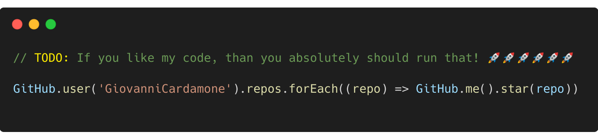

# Hi there 👋 I'm Giovanni!

## I'm a Software Developer 🐈

- :seedling: I’m currently learning Rust, 3D, AI
- :mailbox_with_mail: You can reach me on [My Website](https://giovannicardamone.github.io)
- :zap: Fun fact: I only use linux distro's
- :goal_net: 2023 Goals: Contribute more to Open Source projects

## Connect With Me

[][website]	
[][facebook]	
[][instagram]	
[][linkedin]
[][twitter]

[website]: https://giovannicardamone.github.io
[facebook]: https://www.facebook.com/G.Cardamone2
[instagram]: http://instagram.com/giovannicardamone
[linkedin]: https://www.linkedin.com/in/giovanni-cardamone-41306973/
[twitter]: https://twitter.com/GiovanniCardam2
